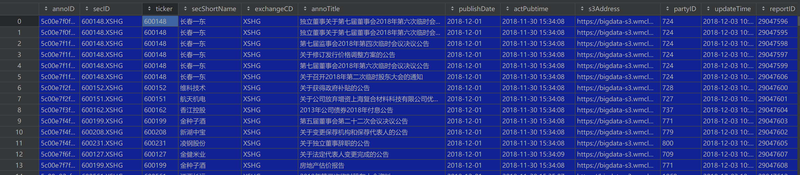

1. 股票公告表信息


2. 实现下载 s3Address 字段链接里的公告 pdf 原始文件，按照 /xxx路径/公告日期/股票ID/公告文件名.pdf 的方式保存
```
import pandas as pd
import requests
import os
from concurrent.futures import ThreadPoolExecutor

src_path = r"/data/stock/AnnoInfo/"
all_file = os.listdir(src_path)
# print(all_file)
for file in all_file:
    print(src_path + file)
    df = pd.read_pickle(src_path + file)
    # print(df)
    # dataframe 打印某几列
    df = df[['publishDate', 'secID', 's3Address', 'annoTitle']]
    # print(df)
    df['secID'] = df['secID'].str.replace('.XSHE', '.SZ')
    df['secID'] = df['secID'].str.replace('.XSHG', '.SH')
    print(df)


    def process_row(row):
        # print(f"Index: {index}, publishDate: {row['publishDate']}, secID: {row['secID']}, s3Address: {row['s3Address']}")
        dest_path = f"/data/stock/AnnoInfoPdf/{row['publishDate']}/{row['secID']}"
        # print(dest_path)
        # 加上 exist_ok=True 参数，避免多线程重复创建路径时报错路径
        if not os.path.exists(dest_path):
            os.makedirs(dest_path, exist_ok=True)
        # 使用字符串处理方法获取文件名
        file_name = row['s3Address'].split("/")[-1]
        # 获取文件后缀
        file_extension = file_name.split(".")[-1]
        response = requests.get(row['s3Address'], stream=True)
        dest_file = f"{dest_path}/{row['annoTitle']}.{file_extension}"
        # 中文文件名有空格或者一些其他符号就会导致保存时带单引号
        dest_file = dest_file.replace(" ", "")
        dest_file = dest_file.replace('(', "")
        dest_file = dest_file.replace(')', "")
        print(dest_file)
        try:
            with open(dest_file.strip("'"), 'wb') as f:
                for chunk in response.iter_content(chunk_size=128):
                    f.write(chunk)
        except Exception as e:
            pass


    # 使用 ThreadPoolExecutor 实现多线程
    with ThreadPoolExecutor(max_workers=64) as executor:
        # 遍历 dataframe 的每一行，提交每一行的处理任务
        futures = [executor.submit(process_row, row) for _, row in df.iterrows()]

        # 等待所有任务完成
        for future in futures:
            future.result()

```
