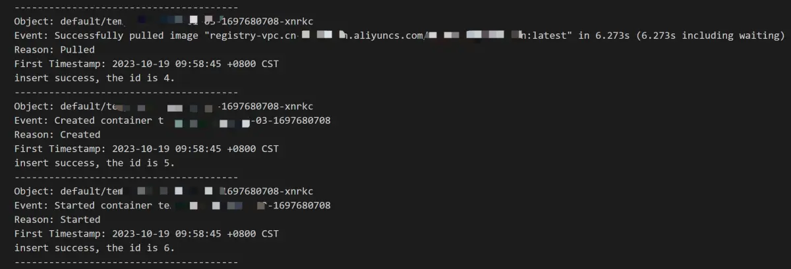
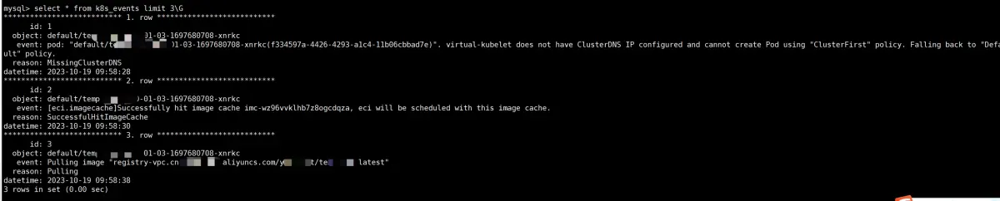

k8s event 记录了集群的状态变更，包括创建 pod、运行 pod、删除 pod、组件异常、pod oom 等，默认保留时间是 1 个小时。

可以考虑把 event 存入到 mysql 做持久化存储，方便后续检索。

1. 创建一个 mysql events 表，使用复合唯一索引约束，避免 event 重复入库
```
CREATE DATABASE `ths`;

//  使用复合唯一索引  (object, event, datetime) ，避免 event 重复入库
CREATE TABLE k8s_events (
  id INT NOT NULL AUTO_INCREMENT,
  object VARCHAR(100),
  event VARCHAR(300),
  reason VARCHAR(100),
  datetime DATETIME,
  UNIQUE KEY idx_event_datetime (object, event, datetime),
  PRIMARY KEY (id)
);
```

2. 具体实现示例代码
```
package main

import (
	"context"
	"database/sql"
	"flag"
	"fmt"
	"log"
	"os"
	"path/filepath"

	_ "github.com/go-sql-driver/mysql"

	metav1 "k8s.io/apimachinery/pkg/apis/meta/v1"
	"k8s.io/client-go/kubernetes"
	"k8s.io/client-go/tools/clientcmd"
	"k8s.io/client-go/util/homedir"

	// *v1.EventList 就是这个包中的一个结构体
	v1 "k8s.io/api/core/v1"
)

func main() {
	err := initDB() // 调用初始化数据库的函数
	if err != nil {
		log.Fatal(err)
	}
	eventList := getEvent()
	// println(eventsList.Items)
	for _, event := range eventList.Items {
		fmt.Printf("Object: %s\n", event.InvolvedObject.Namespace+"/"+event.InvolvedObject.Name)
		fmt.Printf("Event: %s\n", event.Message)
		fmt.Printf("Reason: %s\n", event.Reason)
		fmt.Printf("First Timestamp: %s\n", event.FirstTimestamp)
		insertRow(event)
		fmt.Println("---------------------------------------")
	}
}

func getEvent() *v1.EventList {
	var kubeconfig *string
	if home := homedir.HomeDir(); home != "" {
		kubeconfig = flag.String("kubeconfig", filepath.Join(home, ".kube", "config"), "(optional) absolute path to the kubeconfig file")
	} else {
		kubeconfig = flag.String("kubeconfig", "", "absolute path to the kubeconfig file")
	}

	flag.Parse()

	// use the current context in kubeconfig
	config, err := clientcmd.BuildConfigFromFlags("", *kubeconfig)
	if err != nil {
		panic(err.Error())
	}

	// create the clientset
	clientset, err := kubernetes.NewForConfig(config)
	if err != nil {
		panic(err.Error())
	}

	eventsList, err := clientset.CoreV1().Events("").List(context.TODO(), metav1.ListOptions{})
	if err != nil {
		panic(err.Error())
	}
	if len(eventsList.Items) == 0 {
		println("No events were found in any namespace.")
		os.Exit(1)
	}
	return eventsList
}

var db *sql.DB

// 定义一个初始化数据库的函数
func initDB() (err error) {
	// DSN:Data Source Name
	dsn := "root:123456@tcp(192.168.2.54:3306)/ths?charset=utf8mb4&parseTime=True"
	// 不会校验账号密码是否正确
	// 注意！！！这里不要使用:=，我们是给全局变量赋值，然后在main函数中使用全局变量db
	db, err = sql.Open("mysql", dsn)
	if err != nil {
		return err
	}
	// 尝试与数据库建立连接（校验dsn是否正确）
	err = db.Ping()
	if err != nil {
		return err
	}
	return nil
}

func insertRow(event v1.Event) {
	// insert into ths.k8s_events (object, datetime, event, reason) values ('pod/xxx-xnrkc', '2023-10-13 11:11:43 +0800 CST', 'Created pod: xxx-1697166703-pd6bl', 'SuccessfulCreate')
	sqlStr := "insert into ths.k8s_events (object, datetime, event, reason) values (?, ?, ?, ?)"
	// 将 metav1.Time 转换为 MySQL datetime 格式
	t := event.FirstTimestamp.Time
	mysqlDatetime := t.Format("2006-01-02 15:04:05")
	object := event.InvolvedObject.Namespace + "/" + event.InvolvedObject.Name
	res, err := db.Exec(sqlStr, object, mysqlDatetime, event.Message, event.Reason)
	// 只打印 Duplicate entry 'xxx' for key 'idx_event_datetime' 错误，不退出程序
	if err != nil {
		fmt.Println(err)
	} else {
		theID, err := res.LastInsertId()
		if err != nil {
			fmt.Println(err)
		} else {
			fmt.Printf("insert success, the id is %d.\n", theID)
		}

	}
}
```
3. 实现效果



4. 把代码放在 linux crontab 中，定时运行

5. 后续可以考虑优化成 informer watch 的方式

参考：
1. https://www.liwenzhou.com/posts/Go/mysql/
2. https://kubernetes.io/zh-cn/docs/reference/kubernetes-api/cluster-resources/event-v1/


